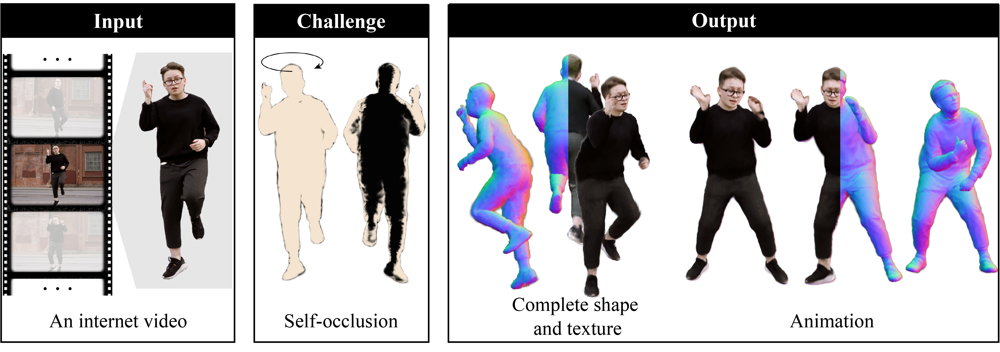
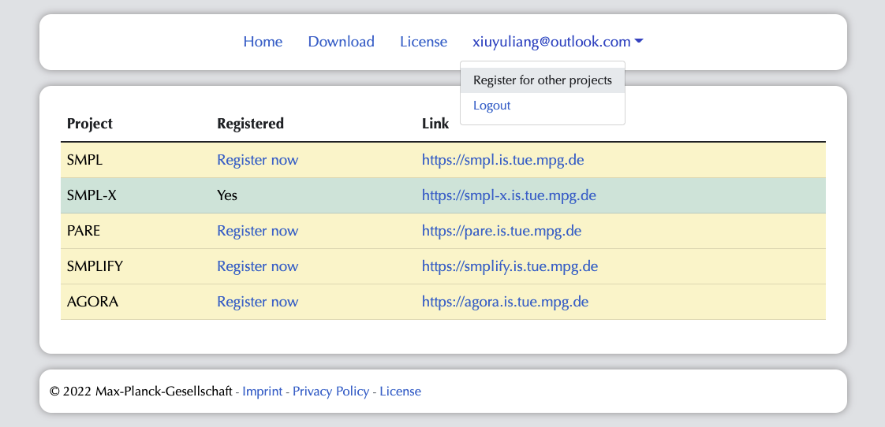

# SOAR 

**[Project page](https://soar-avatar.github.io/) &bull;
[arXiv](https://arxiv.org/abs/)**

This is the official implementation for [SOAR](https://soar-avatar.github.io/).
<div align='center'>

</div>

<!-- <table><tr><td>
Code release for our preprint:
    Zhuoyang Pan<sup>1, 2</sup>, Angjoo Kanazawa<sup>1</sup>, and Hang Gao<sup>1</sup>.
    <strong>SOAR: Self-Occluded Avatar Recovery from a Single Video In the Wild</strong>
    arXiV, 2024.
</td></tr>
</table>
<sup>1</sup><em>UC Berkeley</em>, <sup>2</sup><em>ShanghaiTech University</em> -->

---

## Getting started

SOAR requires Python 3.10 or newer.

1. **Clone the repository.**
   ```bash
   git clone https://github.com/xxx.git --recursive
   ```
2. **Install general dependencies.**
   ```bash
   cd soar
   pip install -e .
   ```
   Please note that after installing the package, you will find that `soar/threestudio-soar` is linked to `submodules/threestudio/custom` and `submodules/threestudio/outputs` is linked to `outputs`. If not, first go to the root folder of SOAR repo and run the following command:
   ```bash
   ln -sf $(pwd)/soar/threestudio-soar $(pwd)/submodules/threestudio/custom/ 
   ln -sf $(pwd)/submodules/threestudio/outputs $(pwd)/outputs
   ```
3. **Register required models at [ICON's website](https://icon.is.tue.mpg.de/)**

    - [SMPL](http://smpl.is.tue.mpg.de/): SMPL Model (Male, Female)
    - [SMPL-X](http://smpl-x.is.tue.mpg.de/): SMPL-X Model, used for training
    - [SMPLIFY](http://smplify.is.tue.mpg.de/): SMPL Model (Neutral)

    :warning: Click **Register now** on all dependencies, then you can download them all with **ONE** account.
    
4. **Download+unzip required models.**
   ```bash
   bash fetch_data.sh
   ```
    This will download and unzip the following files:
   <details>

    ```
    data/
    ├── ckpt/
    │   ├── normal.ckpt
    │   └── sam_vit_h_4b8939.pth
    ├── smpl_related/
    │   ├── models/
    │   │   ├── smpl/
    │   │   │   ├── SMPL_{FEMALE,MALE,NEUTRAL}.pkl
    │   │   │   ├── smpl_kid_template.npy
    │   │   └── smplx/
    │   │       ├── SMPLX_{FEMALE,MALE,NEUTRAL}.npz
    │   │       ├── SMPLX_{FEMALE,MALE,NEUTRAL}.pkl
    │   │       ├── smplx_kid_template.npy
    │   │       └── version.txt
    │   └── smpl_data/
    │       ├── smpl_verts.npy
    │       ├── smplx_cmap.npy
    │       ├── smplx_faces.npy
    │       └── smplx_verts.npy
    └── tedra_data/
        ├── faces.txt
        ├── tetrahedrons.txt
        ├── tetgen_{male,female,neutral}_{adult,kid}_structure.npy
        ├── tetgen_{male,female,neutral}_{adult,kid}_vertices.npy
        ├── tetra_{male,female,neutral}_{adult,kid}_smpl.npz
        ├── tetrahedrons_{male,female,neutral}_{adult,kid}.txt
        └── vertices.txt
    ```

    </details>


5. **(Optional) Download preprocessed demo data.**
You can quickly start trying out SOAR with some preprocessed demo sequences including the pre-trained checkpoint. They can be downloaded from [Google drive](https://drive.google.com/drive/u/1/folders/todo) which are originally video clips from [Pexel](https://www.pexels.com/). Put this preprocessed demo data under the folder `data/custom` and put the folder `checkpoints` under `xxx`.

## Training
<!-- Before training, make sure that the `metaninfo` in the data config file `/code/confs/dataset/video.yaml` does match the expected training video. You can also continue the training by changing the flag `is_continue` in the model config file `code/confs/model/model_w_bg`. And then run: -->
```
bash ./scripts/run_${video}.sh
```
where `${video}` is the name of the video you want to train on. The training script will train the model, and save the checkpoints in the `outputs` folder. The training usually takes around 30 minutes on a NVIDIA RTX A5000. The validation results can be found at `outputs/`.

## Testing

We have provided a minimal set of code to infererence the trained model. The code is located at `soar/threestudio-soar/test/`. You could easily add more features to the code to fit your needs.

To obtain the 360-degree rotation video, you can run the following command:
```
python soar/threestudio-soar/test/render_rot.py --seq_name ${video} --ckpt_path ${ckpt_path}
```
where `${video}` is the name of the video you want to test on, and `${ckpt_path}` is the path to the checkpoint you want to test on. The results will be saved in the `outputs/test/${video}` folder.


## Play on custom video
1. **Install OpenPose and SMPLify-X.**
    
    Follow the instructions at [OpenPose](https://github.com/CMU-Perceptual-Computing-Lab/openpose) and [SMPLify-X](https://github.com/caizhongang/SMPLer-X) to install the required dependencies.

2. **Preprocess custom videos.**

    You can play on your own video by running the following command:
    ```bash
    python preproc/preprocess_custom.py \
        --video-path ./data/custom/<VIDEO.MP4> \
        --data-root ./data/custom/ \
        --openpose-dir /path/to/openpose/ \
        --smplerx-dir /path/to/smplerx/
    ```
    Note that we also have a smoothing hyperparameter `--smooth_weight` which can be used to smooth the smplerx output. The default value is 10000. If this high value makes the output too smooth to be accurate, you can try to lower it to 100 or 0.

    It takes around 30 mins for 400 frames or some big 2K-4K images. For dance_0 it takes around 8 mins.

    Proprocessed data should be saved in the following structure:

    ```
    - VIDEO
        - images/*.png
        - keypoints/*.json
        - masks/*.png
        - normal_B/*.png
        - normal_F/*.png
        - smplx/params.pth
            - some SMPLify-X debugging video here as well.
        - video.mp4
    ```


3. **Setup training script.**

    You need to setup the training script by modifying the `./scripts/run_CUSTOM.sh` script. You need to change the `seq_name` to the name of your video(which is the name of the folder in `data/custom`)
    , and the `prompt` to the prompt you want to use.

4. **Run training script.**
    
    Run the following command to train the model on your custom video.
    ```
    bash ./scripts/run_CUSTOM.sh
    ```

## Status

This repository currently contains:

- `soar` package, which contains reference training and sampling implementation details.
- Setup instructions.
- Training script.
- Testing script. Novel pose rendering script in progress.
- Dataset preprocessing script.

While we've put effort into cleaning up our code for release, this is research
code and there's room for improvement. If you have questions or comments,
please reach out!